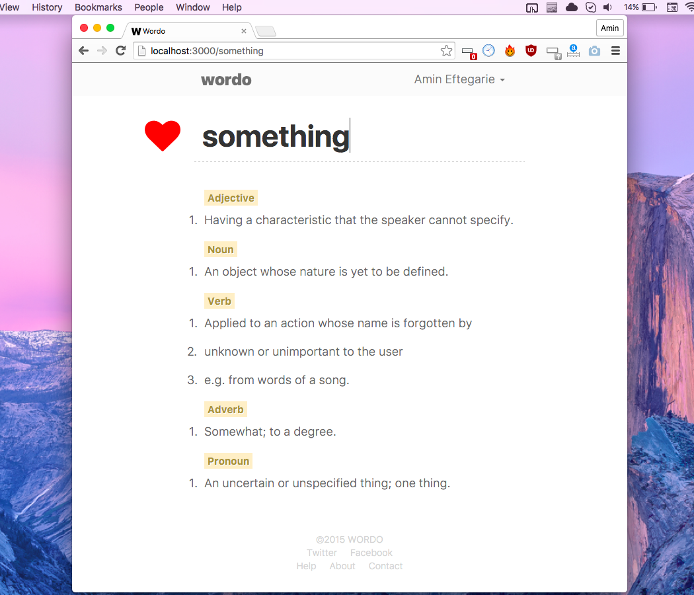

# Wordo

      

### Introduction

Wordo is a new dictionary. Wordo is social, and delivers definitions in a clutter-free interface. Built from the ground with people at it’s centre. 

### Wordo Development Enviroment Setup:

+ clone code `git clone https://github.com/aminozuur/wordo.git`

+ Install [nodejs](https://nodejs.org/en/download/)

+ execute `node -v` and `npm -v` to check successful node installation

+ install gulp `npm install -g gulp`

+ install bower `npm install -g bower`

+ Go to project directory do `npm install`, `bower install`

+ Run project `gulp dev` 

### Server

+ [Deployment Server](https://wordo.deploybot.com/)

+ [Stagging server](http://wordo.co/build/)

+ [Slack :- Messaging App for Team](https://slack.com/) 

### Technology

+ [Node.js :- Development Platform](https://nodejs.org/en/)

+ [ECMAScript 6 :- Superset of Javascript](https://babeljs.io/docs/learn-es2015/)

+ [AngularJS :- JavaScript MVW Framework](https://angularjs.org/)

+ [SASS :- CSS Preprocessors](http://sass-lang.com/)

+ [Firebase :- Cloud Datastore](https://www.firebase.com/) 

+ [gulp :- Build Automation](http://gulpjs.com/)

+ [Bower :- A Package Manager for the Web](http://bower.io/)

### Application URL

+ [Hosted - www.asmallorange.com](http://wordo.co/build/)

+ [Hosted - Firebase](https://wordo.firebaseapp.com/)

## Code Quality

+ https://github.com/spadgos/sublime-jsdocs

+ https://github.com/johnpapa/angular-styleguide
